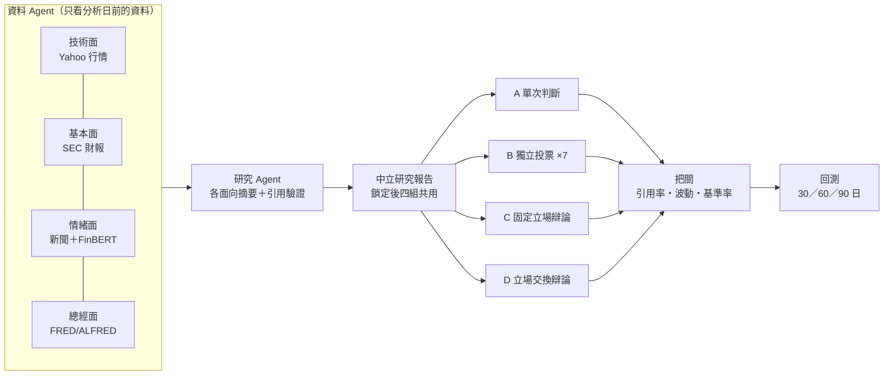

<div align="center">

# Stance Shift Research

**多代理人立場交換辯論 × 可稽核股票回測研究台**

[](https://github.com/paul931130/stance-shift-lab/actions/workflows/ci.yml)
[](LICENSE)
[](pyproject.toml)
[](https://codespaces.new/paul931130/stance-shift-lab)

🚀 [研究框架](#研究框架) | ⚡ [安裝與 CLI](#安裝與-cli) | 📦 [Python 用法](#python-用法) | 🌐 [網頁研究台](#網頁研究台) | 🤝 [貢獻](#貢獻) | 📄 [引用](#引用)

</div>

---

## 最新消息

- [2026-09] **互動式 `stance-shift` CLI 與 Python API**：`pip install` 後一個指令就能跑完蒐集資料、A/B/C/D 四組決策與回測，並即時顯示每一次模型回答。
- [2026-09] **三種模型來源、三種跑法**：雲端模型 API（Gemini／OpenRouter／OpenAI）、GPUtw 雲端 GPU、Ollama；可用 pip、Docker 或 GitHub Codespaces 執行。
- [2026-09] **協議 v3-0926.7**：數字檢查比對模型實際看到的完整提示詞，大幅減少「財務摘要包含來源未支持的數字」的誤判；支援 Gemini 3.1 Pro。

完整變更見 [CHANGELOG.md](CHANGELOG.md)。

## 研究框架

Stance Shift Research 研究一個問題：**讓 AI 辯論時中途交換立場，判斷會不會更準？** 同一個股票案例、同一份資料、同一個模型，只改變決策方式，比較四組的方向準確率與報酬。



### 資料 Agent

- **技術面**：Yahoo Finance 還原 OHLC，含分析日前 900 個日曆日與之後的回測行情。
- **基本面**：SEC XBRL 財報，依申報日（filing date）只取分析日前已公開的數字。
- **情緒面**：Alpha Vantage、FNSPID 新聞標題，可用本機 FinBERT 評分。
- **總經面**：FRED／ALFRED，依發布版本（vintage date）只取當時看得到的數值。

四個 Agent 同時蒐集，結果存成不可變的資料集；之後每一次實驗都讀同一份，不會再連網，比較才公平。

### 研究 Agent 與中立報告

每個面向由一個研究 Agent 摘要證據，每個數字都必須能在來源找到原樣，否則改用可追溯的來源摘錄並標記。四份摘要合併為**中立研究報告**，鎖定雜湊值後交給四組使用。

### 四組決策

- **A 單次判斷**：模型讀報告後做一次決策。
- **B 獨立投票**：同樣的提示詞取樣 7 次、多數決，呼叫次數與 C／D 相同。
- **C 固定立場辯論**：看多、看空兩個 Agent 辯論 3 輪，再由裁決者決定。
- **D 立場交換辯論**：和 C 相同，但第 2 輪雙方交換立場、第 3 輪換回，測試「站在對方角度想過」是否改善判斷。

### 把關與回測

把關者檢查引用有效率、年化波動、歷史基準率是否足夠，必要時把 Buy／Sell 改為 Hold 或 NoTrade，並保留原始決策供比較。回測以 60 個交易日為主要期間，30／90 日為穩健性檢查，報酬同時提供不計成本與扣除 Corwin–Schultz 估計價差兩種版本。

> 本專案只用於研究與教育，不執行交易，也不是投資建議。回測結果會受模型、溫度、期間、資料品質與其他隨機因素影響；單筆試跑與合成測試不能當成投資績效結論。

## 安裝與 CLI

### 安裝

需要 Python 3.12 以上：

```bash
git clone https://github.com/paul931130/stance-shift-lab.git
cd stance-shift-lab
python -m venv .venv
source .venv/bin/activate        # Windows：.venv\Scripts\activate
pip install ".[finbert]"         # 不需要新聞情緒評分可改成 pip install .
```

Linux 上 `pip` 預設會裝含 CUDA 的 PyTorch（整個環境約 7 GB）。FinBERT 只需要 CPU，先執行下面這行再裝，可省下約 5 GB：

```bash
pip install torch==2.8.0 --index-url https://download.pytorch.org/whl/cpu
```

裝好後可以先不填任何金鑰試跑一次，看看整個流程：

```bash
RESEARCH_DEMO_MODE=true stance-shift     # Windows PowerShell：$env:RESEARCH_DEMO_MODE="true"; stance-shift
```

展示模式使用內建的合成 NVDA 2024-12-31 資料與固定回應，不連網、不呼叫模型，結果不是研究資料。

### Docker

不想裝 Python，也可以用 Docker：

```bash
cp research.env.example .env.research   # 填入金鑰
./research.sh cli                       # 在容器內執行互動式 stance-shift
```

Windows 用 `docker compose -f compose.research.yaml run --rm research python -m research_service.cli`。要讓 Docker 一起跑 Ollama，加上 `-f compose.ollama.yaml`（NVIDIA 顯示卡再加 `-f compose.ollama-gpu.yaml`）；詳見 [執行方式](docs/run-options.md)。

### 必要的 API 金鑰

資料來源（都免費）：

```bash
SEC_USER_AGENT="Your Name you@example.com"   # SEC 財報，不用申請
FRED_API_KEY=...                             # 總經資料：https://fred.stlouisfed.org/docs/api/api_key.html
ALPHA_VANTAGE_API_KEY=...                    # 新聞：https://www.alphavantage.co/support/#api-key
```

模型三選一：

```bash
GEMINI_API_KEY=...             # 雲端模型 API：Gemini（或 OPENROUTER_API_KEY、OPENAI_API_KEY）
GPUTW_OLLAMA_BASE_URL=...      # 雲端租 GPU：GPUtw 遠端 Ollama 位址
GPUTW_OLLAMA_API_KEY=...       #   及存取 key
                               # 自己電腦的 Ollama：不用金鑰，先執行 ollama pull qwen3:14b
```

可以寫成環境變數，或複製範本後填入：

```bash
cp research.env.example .env
```

什麼都不先填也可以：`stance-shift` 第一次執行時會一題一題問，並存在 `research-data/` 裡，網頁研究台也讀得到。各模型來源的比較與 GPUtw 設定見 [選擇模型來源](docs/model-sources.md)、[GPUtw 整合指南](docs/gputw-integration.md)。

> 金鑰不要貼到聊天、issue 或 commit 裡；不小心外流了，就到申請的網站作廢、重新產生。

### CLI 用法

```bash
stance-shift
```

會出現一連串問題：股票、分析日、模型來源、是否用 FinBERT。上一次的答案會變成預設值，直接按 Enter 就沿用；`.env` 或環境變數 `STANCE_SHIFT_TICKER`、`STANCE_SHIFT_DATE`、`STANCE_SHIFT_MODEL` 已設定的問題會直接跳過。

執行時即時顯示四個資料 Agent、四個研究 Agent，以及 A/B/C/D 每一次模型回答，最後列出四組決策與 60 日回測（以下為示意）：

```text
[資料] 四個資料 Agent 開始蒐集…
  ✓ 技術面：已取得一致還原 OHLC；Yahoo Finance
  ✓ 基本面：已取得 12 筆證據
[決策] 中立研究報告已鎖定，A/B/C/D 開始決策
  [ 1/22] A 單次判斷 · 決策 → Buy  預期 4.0%  信心 0.75
  [13/22] D 立場交換辯論 · 第 2 輪 看空 → Sell  預期 -4.0%  信心 0.75
  …
=== NVDA · 2024-12-31 · gemini/gemini-2.5-flash ===
組別            決策       預期報酬     信心  把關原因
A 單次判斷       Buy          4%   0.75  —
…
```

給腳本用、不問問題：

```bash
stance-shift run NVDA 2024-12-31 --model gemini/gemini-2.5-flash --finbert
stance-shift run NVDA 2024-12-31 --model ollama/qwen3:14b --json   # 只輸出 JSON
stance-shift jobs                    # 最近的實驗
stance-shift resume <實驗 ID>        # 模型斷線等中斷後，從保存的進度繼續
stance-shift serve                   # 開網頁研究台 http://127.0.0.1:8000/
```

### 研究範圍

- **股票**：AAPL、NVDA、GOOGL、MSFT、AMZN、JPM、MCD、INTC、GE（9 檔，FNSPID 新聞有涵蓋）。
- **分析日**：2021–2025 每季季末（共 20 季），正式研究共 9 × 20 = 180 個案例；也可以選今天做當下分析，但不計入正式統計。
- **模型**：正式協議使用 `ollama/qwen3:14b`（本機或 GPUtw），OpenRouter 的 `openrouter/qwen/qwen3-14b` 是同一個模型；`qwen3:8b` 已通過相容性測試也可正式使用。其他 14B 以下模型只算測試；改用 Gemini 等其他模型時，需在研究紀錄中註明。

## Python 用法

### 實作細節

流程以 LangGraph 協調，每一步都寫入 SQLite 檢查點，中斷後可以從同一步繼續。模型呼叫透過 LiteLLM，支援 Ollama（本機或 GPUtw）、Gemini、OpenRouter、OpenAI。所有模型輸出都經過來源驗證：引用的證據 ID 必須存在，財務數字必須能在模型看到的內容中找到原樣。

### 用法

```python
from research_service import StanceShiftResearch

research = StanceShiftResearch(model="gemini/gemini-2.5-flash")
result = research.run("NVDA", "2024-12-31", use_finbert=True)

for group, decision in result["decisions"].items():
    print(group, decision["name"], decision["action"], decision["expected_return_pct"])
```

也可以分步呼叫，並調整實驗選項：

```python
research = StanceShiftResearch(model="ollama/qwen3:14b", data_dir="research-data")
dataset = research.collect("MSFT", "2024-09-30", use_finbert=True)
job_id = research.start("MSFT", "2024-09-30", dataset_id=dataset["id"],
                        voting_samples=7, anonymize_ticker=True)
result = research.resume(job_id)          # 中斷後再呼叫一次就會從檢查點繼續
```

其他選項（`missing_data_policy`、`allow_small_model`、`allow_low_quality_sentiment`、`allow_point_fundamental`）與網頁表單相同；協議參數見 `research_service/protocol.py`。結果和網頁研究台存在同一個資料庫，之後用 `stance-shift serve` 可以看到完整紀錄。

## 網頁研究台

CLI 適合看單一案例；正式研究用網頁研究台：180 個案例的資料就緒度、批次排程、四組配對統計、試跑檢查與事前登記（鎖定研究樣本）、匯出研究產物 ZIP。

```bash
stance-shift serve        # 開 http://127.0.0.1:8000/
```

也可以用 Docker（`./research.sh start`）或直接在 GitHub 開 [Codespaces](https://codespaces.new/paul931130/stance-shift-lab)。三種跑法、各自能接哪些模型、Codespaces 的注意事項（第二次以後要打開原本那台，開新的會沒有資料）見 [執行方式](docs/run-options.md)。

| | pip | Docker | Codespaces |
| --- | --- | --- | --- |
| 雲端模型 API | ✅ | ✅ | ✅ |
| GPUtw | ✅ | ✅ | ✅ |
| Ollama | ✅ | ✅（可由 Docker 一起跑） | ❌ 沒有顯示卡 |

## 回測資料

| 研究面向 | 正式來源 | 建立資料集時的處理 |
| --- | --- | --- |
| 技術面 | Yahoo Finance adjusted OHLC | 下載分析日前行情與 30/60/90 日回測需要的未來行情 |
| 基本面 | SEC XBRL | 依 filing date 保存分析日前可得的財報證據 |
| 情緒面 | Alpha Vantage、FNSPID、可選本機 FinBERT | 使用分析日前 90 天的標題／摘要；Alpha Vantage 以目標 ticker 相關性排序並過濾，FNSPID 本機檔只保存必要欄位；FinBERT 對標題離線評分 |
| 總經面 | FRED/ALFRED | 依 vintage date 保存當時可取得的總經資料 |

四個面向的資料在「建立資料集」時一次取得，存進 SQLite 資料庫；之後跑 A/B/C/D 實驗只讀取選定的資料集，不會再呼叫市場資料 API。重跑模型時請重用同一個資料集，比較才公平。資料就緒度分開顯示：四個面向齊全、SEC 基本面可比較、FinBERT／新聞品質、60 日主要回測與 90 日次要回測。正式實驗需要可比較的 SEC 指標、所有新聞標題都完成 FinBERT 評分，且新聞提及目標公司的比例至少 50%；舊版 SEC 基本面或品質不足的新聞，只能在勾選例外後作為敏感性測試。

行情會下載分析日前 900 個日曆日，讓 60 個交易日、互不重疊的基準窗口至少有 8 個。舊版只下載 400 日的資料集仍可查看，但用於目前版本的正式研究前應重新蒐集。版本差異與遷移方式見 [版本紀錄](CHANGELOG.md)。

## 憑證與資料安全

`stance-shift` 與 `setup` 都會隱藏秘密輸入；金鑰只存在 Git 忽略的 `.env`／`.env.research` 或 `research-data/private/`。網頁只顯示來源是否就緒，不把 API key 寫入瀏覽器儲存空間。公開部署時，憑證屬於伺服器營運者；若未來改成多使用者服務，必須另做使用者身分、加密憑證庫、額度與隔離，不能共用目前的單一研究室設定。

以下內容不會進入 Git 或 Docker 映像：

- `.env.research` 與所有 API key
- `research-inputs/*.csv`、原始 FNSPID 檔
- SQLite 研究資料、工作輸出與本機模型

資料授權仍由部署者負責。不要把 Yahoo、FNSPID 或其他來源的原始資料直接提交到公開儲存庫。

## 專案結構

- `research_service/`：正式 FastAPI 後端、研究流程與網頁工作台
- `research-inputs/`：本機唯讀資料輸入；大型檔案由 Git 忽略
- `scripts/`：FNSPID 整理、CLI 與驗證工具
- `docs/`：研究口徑、操作、部署與審查文件
- `compose.research.yaml`、`Dockerfile.research`：正式執行封裝
- `compose.ollama.yaml`、`compose.ollama-gpu.yaml`：選用，讓 Ollama 以容器一起執行（CPU／NVIDIA GPU）
- `CHANGELOG.md`：各協議版本的行為變更紀錄
- `docs/run-options.md`：pip／Docker／Codespaces 三種跑法的完整步驟

更完整的整理原則見 [專案結構](docs/project-layout.md)，目前驗證結果、正式研究缺口與公開發布優先序見 [v3-0912.1 最終審查](docs/final-review-2026-09-12.md)。

**Repo 大小**：git 歷史約 7 MB、追蹤的程式碼約 1.5 MB（`research_service/`、`scripts/`、`docs/`）；`research-inputs/`、下載的行情快照、備份 zip 等大型檔案都被 `.gitignore` 排除，不會進 repo，clone 下來很小。**Docker image 約 2.3 GB**——主要是 PyTorch（CPU 版）＋ transformers，用來跑本機 FinBERT 離線評分；這是刻意的取捨（不需要外部 GPU 或付費 API 就能評分新聞情緒），不是意外堆出來的體積，但 build 時第一次要下載這些套件，網路慢的話會花一點時間。

更細的首次啟動說明見 [Clone 後首次啟動](docs/getting-started.md)。只想驗證回測流程，可照 [本機回測 Demo](docs/demo-backtest.md) 操作；這份流程會固定在歷史資料模式，並說明如何辨認完整資料集 ID、暫停續跑與匯出研究產物。

若要把模型推論移到 GPUtw，請參考 [GPUtw 整合指南](docs/gputw-integration.md)。研究台可讀取 GPUtw 執行個體狀態並使用受保護的遠端 Ollama；部署或停止 GPU 執行個體仍在 GPUtw 控制台手動完成。

## 驗證

```bash
ruff check research_service scripts
python -m unittest discover -s research_service/tests -p "test_*.py"
```

CI 每次推送都會在 Linux／Windows 跑單元測試，在 x86-64 與 ARM64 實際啟動 Docker 服務，並測試 pip 安裝、Codespace 啟動、Ollama 容器與瀏覽器端到端流程。全新環境可重現性驗證與公開部署（HTTPS、存取金鑰、備份）見 [部署指南](docs/deploy-v3.md) 與 [GitHub 發布檢查表](docs/github-release-checklist.md)。

## 貢獻

歡迎回報問題、修正錯誤、改善文件或提出研究設計建議。發 PR 前請照 [PR 範本](.github/PULL_REQUEST_TEMPLATE.md) 跑過 lint 與測試；會改變研究協議、決策提示詞或資料口徑的修改，必須在 [`CHANGELOG.md`](CHANGELOG.md) 記錄並升級協議版本。

## 引用

如果這個專案對你的研究有幫助，歡迎引用：

```bibtex
@software{stance_shift_research,
  title  = {Stance Shift Research: Auditable Multi-Agent Stance-Switching Debate for Stock Backtesting},
  author = {paul931130},
  year   = {2026},
  url    = {https://github.com/paul931130/stance-shift-lab}
}
```

## 授權

程式碼採 [MIT License](LICENSE)。Yahoo、SEC、FNSPID、FRED 等第三方資料與 FinBERT 等模型權重各自受其原始授權條款拘束，不在本授權範圍內；使用者需自行確認資料與模型的再散布權限。
