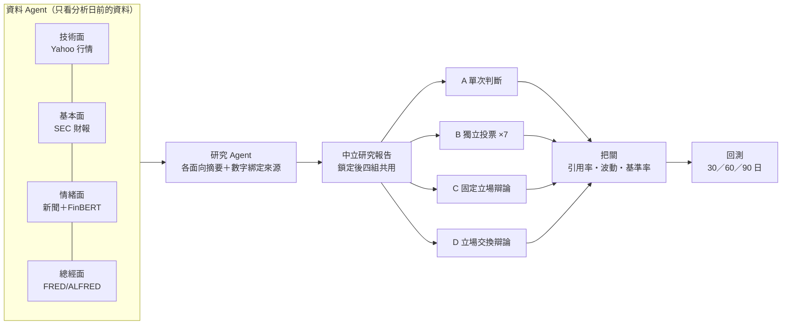
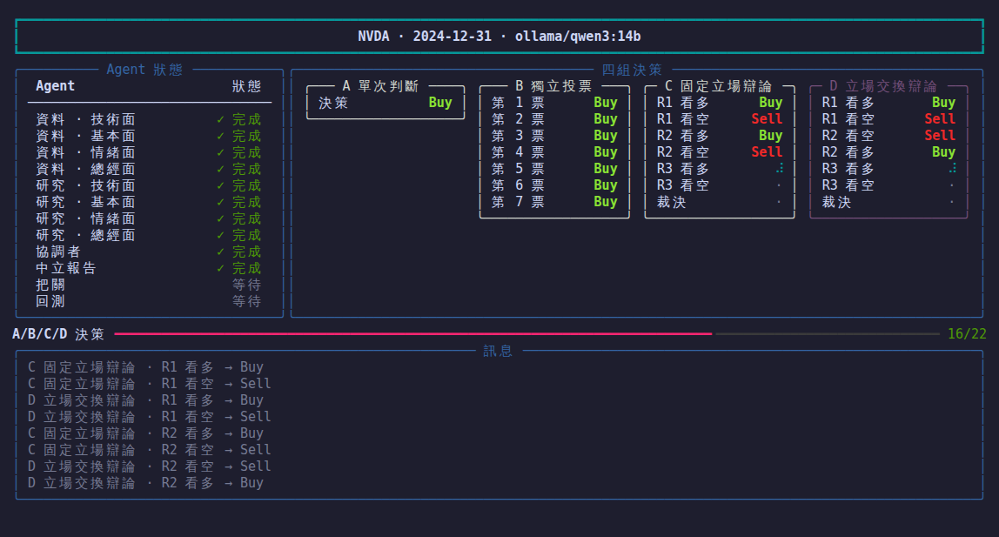

<div align="center">

# Stance Shift Research

**多代理人立場交換辯論 × 可稽核股票回測研究框架**

[](https://github.com/paul931130/stance-shift-lab/actions/workflows/ci.yml)
[](LICENSE)
[](pyproject.toml)
[](https://codespaces.new/paul931130/stance-shift-lab)

🚀 [研究問題](#研究問題) | ⚡ [五分鐘試跑](#五分鐘試跑) | 🧪 [跑正式實驗](#跑正式實驗) | 📦 [CLI 與 Python](#cli-與-python) | 📚 [文件](#文件) | 📄 [引用](#引用)

</div>

---

## 最新消息

- [2026-10] **正式實驗總覽與 GPU 自動關機**：網頁最上方直接看每個事前登記研究的進度、錯誤與剩餘時間；佇列閒置 15 分鐘自動關閉 GPUtw 機器，不再空燒算力。
- [2026-09] **協議 v3-1001.1**：文字裡的每個數字都要綁定來源證據（`numeric_claims`）；情緒面改用窗口內**全部**新聞標題的 FinBERT 指標。
- [2026-09] **記憶污染檢查**：Gemini 3.1 Pro 不看資料也能以 89% 準確率「回想」2022–2024 的漲跌；qwen3:32b 沒有這個現象。見 [知識截止日](docs/knowledge-cutoff.md)。

完整變更見 [CHANGELOG.md](CHANGELOG.md)。

## 研究問題

**讓 AI 辯論時中途交換立場，判斷會不會更準？** 同一個股票案例、同一份資料、同一個模型，只改變決策方式，比較四組的方向準確率與風險調整後報酬。



| 組別 | 做法 | 用途 |
|---|---|---|
| **A 單次判斷** | 讀報告後決策一次 | 基準 |
| **B 獨立投票** | 同一提示取樣 7 次、多數決 | 排除「呼叫次數多」本身的效果 |
| **C 固定立場辯論** | 看多、看空各一個 Agent 辯論 3 輪，再由裁決者決定 | 對照組 |
| **D 立場交換辯論** | 第 2 輪雙方交換立場，且交換輪只看自己第 1 輪的論述（C 第 2 輪看得到雙方） | **實驗組**：D−C 是「交換立場＋資訊可見性」的整套效果 |

- **RQ1**：同一模型內 D 是否優於 C（主要比較），B、A 為對照。季度設計：9 檔 × 20 個季末（2021–2025）＝ 180 案，主要期間 60 個交易日。
- **RQ2**：改成月度（540 案、20 個交易日）時結論是否一致。
- **RQ3**：換一個模型時結論是否一致。

每個數字都必須能追溯到來源；資料集在建立時一次取得並鎖定雜湊，之後的實驗都讀同一份。正式樣本在執行前事前登記，登記後不能更改。

> 本專案只用於研究與教育，不執行交易，也不是投資建議。

## 五分鐘試跑

不需要任何金鑰，用內建的合成資料看完整流程：

```bash
git clone https://github.com/paul931130/stance-shift-lab.git
cd stance-shift-lab
python -m venv .venv && source .venv/bin/activate   # Windows：.venv\Scripts\activate
pip install .
RESEARCH_DEMO_MODE=true stance-shift                 # Windows PowerShell：$env:RESEARCH_DEMO_MODE="true"; stance-shift
```

展示模式不連網、不呼叫模型，結果不是研究資料。也可以用 Docker（`./research.sh start`，Windows 用 `.\research.ps1 start`）或直接開 [Codespaces](https://codespaces.new/paul931130/stance-shift-lab)，見 [執行方式](docs/run-options.md)。

## 跑正式實驗

正式實驗用網頁研究台（`stance-shift serve` 或 Docker，開 <http://127.0.0.1:8000/>）。

1. **準備金鑰**：複製 `research.env.example` 為 `.env.research`，填入資料來源（SEC、FRED、Alpha Vantage，都免費）與模型來源。
2. **準備模型**：正式協議使用 `ollama/qwen3:32b`。沒有 32 GB 顯示卡時，照 [GPUtw 雲端 GPU](docs/gputw-integration.md) 開一台固定版本的 Ollama 機器（RTX 5090 約 $0.75／小時）。
3. **建立資料集**：「資料準備」步驟會顯示 180 個案例的就緒度與缺口。
4. **事前登記並排入**：把案例清單（`{"cases": [...]}`）在「建立實驗 → 批次研究」匯入並勾選事前登記；或在最上方「正式實驗」卡按「排入批次檔」。排入可以重複按，已建立的案例會略過。
5. **看進度**：「正式實驗」卡顯示完成數、錯誤案例、剩餘時間與 GPU 狀態。出錯的案例會自動暫停，修好後按「全部繼續」。
6. **看結果**：「統計結果」步驟比較四組，並提供 `summary.csv` 與完整統計 JSON。

完整操作、費用與注意事項見 [跑正式實驗](docs/running-experiments.md)。

## CLI 與 Python

單一案例可以直接在終端機跑，會出現即時儀表板：

```bash
stance-shift                                   # 互動選單：股票、分析日、模型
stance-shift run NVDA 2024-12-31 --model ollama/qwen3:32b --finbert
stance-shift jobs                              # 最近的實驗
stance-shift resume <實驗 ID>                  # 中斷後從保存的進度繼續
stance-shift serve                             # 開網頁研究台
```

<p align="center"></p>

```python
from research_service import StanceShiftResearch

research = StanceShiftResearch(model="ollama/qwen3:32b")
result = research.run("NVDA", "2024-12-31", use_finbert=True)
for group, decision in result["decisions"].items():
    print(group, decision["action"], decision["expected_return_pct"])
```

模型呼叫透過 LiteLLM，支援 Ollama（本機或 GPUtw）、Gemini、OpenRouter、OpenAI；流程每一步都寫入 SQLite 檢查點，中斷後可以從同一步繼續。

## 資料來源

| 面向 | 來源 | 時間點處理 |
|---|---|---|
| 技術面 | Yahoo Finance 還原 OHLC | 分析日前 900 個日曆日；分析日後的行情只供回測 |
| 基本面 | SEC XBRL | 依申報日（filing date），只與前一年同期比較 |
| 情緒面 | FNSPID、Alpha Vantage、本機 FinBERT | 分析日前的新聞窗口（季度 90 天、月度 30 天）內全部標題 |
| 總經面 | FRED／ALFRED | 依發布版本（vintage date） |

FNSPID 對部分股票與年份沒有新聞（例如 JPM、MCD 在 2020 年後），缺口與處理方式記錄在各實驗的事前登記文件中。原始資料的授權由使用者自行確認，不要把 Yahoo、FNSPID 等原始資料提交到公開儲存庫。

## 文件

| 想做什麼 | 看這份 |
|---|---|
| 第一次安裝、三種跑法 | [執行方式](docs/run-options.md)、[Clone 後首次啟動](docs/getting-started.md) |
| 跑一整批正式實驗 | [跑正式實驗](docs/running-experiments.md) |
| 租雲端 GPU | [GPUtw 雲端 GPU](docs/gputw-integration.md)、[選擇模型來源](docs/model-sources.md) |
| 系統架構 | [多代理架構](docs/multi-agent-architecture.md)、[專案結構](docs/project-layout.md) |
| 研究方法 | [統計方法](docs/statistical-methods.md)、[時間切分](docs/temporal-split.md)、[知識截止日與記憶污染](docs/knowledge-cutoff.md) |
| 本專題的實驗 | [實驗架構](docs/experiment-architecture.md)、[E2′ 事前登記](docs/e2prime-preregistration.md) |

舊的審查與交接紀錄在 `docs/archive/`。

## 驗證

```bash
ruff check research_service scripts
python -m unittest discover -s research_service/tests -p "test_*.py"
```

CI 在 Linux／Windows 跑單元測試、以 ES module 檢查前端、跑瀏覽器端到端測試，並在 x86-64 與 ARM64 實際啟動 Docker 服務。

## 貢獻

歡迎回報問題與提出研究設計建議。會改變研究協議、決策提示詞或資料口徑的修改，必須在 [`CHANGELOG.md`](CHANGELOG.md) 記錄並升級協議版本；詳見 [CONTRIBUTING.md](CONTRIBUTING.md)。

## 引用

```bibtex
@software{stance_shift_research,
  title  = {Stance Shift Research: Auditable Multi-Agent Stance-Switching Debate for Stock Backtesting},
  author = {paul931130},
  year   = {2026},
  url    = {https://github.com/paul931130/stance-shift-lab}
}
```

## 授權

程式碼採 [MIT License](LICENSE)。Yahoo、SEC、FNSPID、FRED 等第三方資料與 FinBERT 等模型權重各自受其原始授權條款拘束，不在本授權範圍內。
