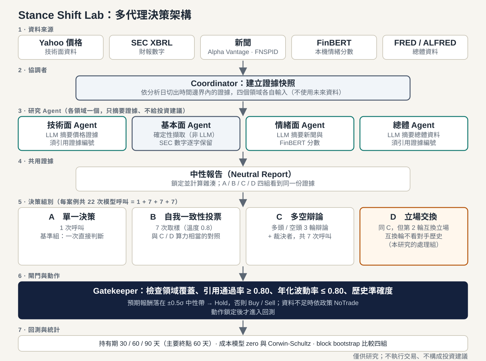

# 多代理架構說明

本文件依 `research_service/protocol.py` 與 `research_service/engine.py` 整理（協議版本 v3-0922.4）。圖檔：[multi-agent-architecture.svg](img/multi-agent-architecture.svg)（圖中對交換輪歷史的描述為早期版本，尚待更新）。

## 一個案例的流程

一個「案例」是「標的 × 季度末分析日」（9 檔股票 × 20 個季度 = 180 案例）。

1. **Coordinator** 依分析日切出時間邊界內的證據，建立技術、基本面、情緒、總體四個領域的輸入，避免使用未來資料。
2. **研究 Agent**：每個領域一個，只摘要供給的證據，不給投資建議，輸出須引用證據編號並通過來源驗證。
   - 技術、情緒、總體由 LLM 摘要。
   - **基本面不經 LLM**：`source_locked_fundamental` 以確定性方式擷取 SEC 數字，逐字保留。
   - LLM 輸出驗證失敗時，重試最多 `provider_retry_attempts` 次，仍失敗則降級為可追溯的來源摘錄，並標記 `degraded`。
3. **中性報告**：合併四個領域，鎖定並計算雜湊。四個決策組別看到同一份報告。
4. **決策組別**（每案例共 22 次模型呼叫）：

| 組別 | 做法 | 呼叫數 |
|---|---|---|
| A | 單一決策，作為基準 | 1 |
| B | 自我一致性投票，溫度 0.8，取 7 次樣本；與 C/D 算力相當 | 7 |
| C | 多頭 / 空頭各發言，共 3 輪，再由裁決者裁決 | 3×2 + 1 = 7 |
| D | 同 C，但**第 2 輪兩位辯論者互換立場，且必須反駁自己第 1 輪的主張** | 7 |

   B 的取樣、其他組的對話歷史彼此隔離（`visible_history`）。D 組交換輪（`switch_isolation=True`，預設開啟）只看得到**自己**第 1 輪的發言、看不到對手的，逼模型直接對抗自己剛才的論點，而不是照抄對手的說法；輸出須包含 `rebutted_claim`（指出被推翻的原主張）與 `confidence_shift`（交換前後的信心變化，-1 到 1）。

5. **Gatekeeper**（`engine.gate`）：檢查領域覆蓋、引用通過率（下限 0.80）、年化波動率（上限 0.80）、歷史準確度；預期報酬落在 ±0.5σ 中性帶則為 Hold，否則 Buy 或 Sell（`derive_action`）。資料不足時依 `missing_data_policy` 處理。動作鎖定後才進入回測。
6. **回測與統計**：持有期 30 / 60 / 90 天，主要終點 60 天；成本模型 zero 與 Corwin-Schultz；block bootstrap 比較各組。

## 研究設計重點

- **D 相對於 C 的差異只有「第 2 輪互換立場」**，用來測量立場交換本身是否改變決策。
- **A、B 是對照**：B 與 C/D 的呼叫數相同，用來排除「只是多跑幾次」的效果。
- 溫度、種子、重試次數、閘門門檻都在 `StudyProtocol` 內，變更會改變協議雜湊。

## 尚未釐清的地方

- 圖中的 Agent 名稱（技術面、情緒面等）是依程式中的領域名稱與角色整理的展示用名稱。
- 「歷史準確度」目前是警示性質，需至少 5 筆已評分紀錄才會生效。

僅供研究；不執行交易、不構成投資建議。
